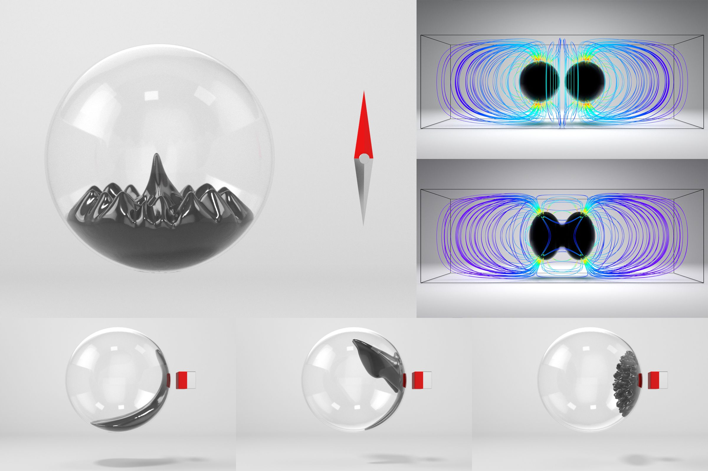

# SimFerrofluid

 

Research code for 3D grid-based ferrofluid simulation and visualization.

## Solver Backends

The magnetic solver can be switched at runtime.

- `--mag-solver=iob` uses the method from [An Induce-on-Boundary Magnetostatic Solver for Grid-Based Ferrofluids](https://doi.org/10.1145/3658124), ACM Transactions on Graphics, 2024.
- `--mag-solver=fdm` uses the method from [A level-set method for magnetic substance simulation](https://doi.org/10.1145/3386569.3392445), ACM Transactions on Graphics, 2020.

Additional material for the IoB method:

- Project page with rendered results: <https://ferrofluid-simulation.github.io/>
- Open-source 2D reference implementation: <https://github.com/Univstar/IoB-Ferrofluid-2D>

## Repository Structure

- `core/`: simulation kernels and supporting data structures
- `demo/`: command-line entry point and scene setup code
- `SimViewer/`: viewer application for inspecting generated outputs
- `fmmtl/`: supporting library code used by the IoB backend
- `MC-style-vol-eval/`: auxiliary volume-evaluation code

## Requirements

- Windows
- [xmake](https://xmake.io/)
- Visual Studio with the Desktop development with C++ workload
- Git

Most third-party dependencies are resolved through xmake. In practice, this project also depends on Boost through xmake's package resolution chain for `amgcl`.

## Clone And Setup

This repository uses git submodules. Clone with submodules enabled:

```bash
git clone --recursive https://github.com/ferrofluid-simulation/SimFerrofluid.git
cd SimFerrofluid
```

If you already cloned the repository without submodules, run:

```bash
git submodule update --init --recursive
```

## Build

### Compile

Configure the build mode with `xmake f -m <mode>` before building. The two common modes are:

- `release` — enables optimization, no debug symbols (default)
- `debug` — disables optimization, includes debug symbols

```bash
xmake f -m release
xmake f -m debug
```

Then build from the repository root:

```bash
xmake
```

This builds both the simulation executable and the viewer target.

### Toolchain Notes For Windows

As of April 29, 2026, the Boost package used by this project does not install correctly with a plain Visual Studio 2026 toolchain in xmake.

Use one of these setups:

1. Recommended: build with Visual Studio 2022.
2. Alternative: keep Visual Studio 2026, but install an older MSVC toolset and pin it explicitly in xmake.

Recommended configuration with VS2022:

```bash
xmake f --vs=2022 -m release
```

If you must build from VS2026, install an older MSVC toolset first, then pass the full toolset version to xmake. For example:

```bash
xmake f --vs=2026 --vs_toolset=14.39.33519 -m release
```

Notes:

- `14.39.33519` is a full MSVC toolset version from the VS2022 toolchain family. You can find installed toolset versions by looking at subdirectory names under `C:\Program Files\Microsoft Visual Studio\<vs_version>\Community\VC\Tools\MSVC\`.
- Replace it with the exact full version you actually installed if you are using a different older toolset.
- In current xmake documentation and source, the official option name is `--vs_toolset`.
- If you see `vc_toolset` mentioned in older notes or local scripts, use the same full version number, but prefer the official `--vs_toolset` spelling for xmake itself.

### VSCode IntelliSense

To enable code completion and IntelliSense in VSCode, first generate `.vscode/c_cpp_properties.json` via `Ctrl+Shift+P` → `C/C++: Edit Configurations (UI)`.

Then generate `compile_commands.json` with:

```bash
xmake project -k compile_commands
```

Finally, add `"compileCommands": "compile_commands.json"` to `.vscode/c_cpp_properties.json` after `"intelliSenseMode"`:

```json
"intelliSenseMode": "windows-msvc-x64",
"compileCommands": "compile_commands.json"
```

## Quick Start

Two example runs for the same scene with different magnetic solvers:

```bash
xmake r demo -t plane -e 401 -r 500 --mag-solver=fdm -s 192 -c .5
```

```bash
xmake r demo -t plane -e 401 -r 500 --mag-solver=iob -s 192 -c .5
```

By default, the demo writes outputs to the `output` directory.

Other demo cases with IoB solver:

```bash
xmake r demo -t dipole -e 401 -r 500 -d 40 -s 256 -c 0.5
xmake r demo -t magsphere -e 281 -r 500 -d 40 -s 192
xmake r demo -t lifting -e 651 -r 500 -d 50 -s 320
xmake r demo -t pattern -e 401 -r 4000 -d 100 -s 768
xmake r demo -t pattern2 -e 401 -r 4000 -d 100 -s 1024
xmake r demo -t pattern3 -e 601 -r 2000 -d 100 -s 768
```

## Visualization

You can launch the viewer after the simulation finishes, or while results are being generated:

```bash
xmake r viewer
```

The viewer reads `output` by default. If you want to inspect another directory, run:

```bash
xmake r viewer -- --dirname path/to/simulation_output
```

More viewer-specific details are available in `SimViewer/README.md`.

## Citation

If you use this repository in academic work, please cite the paper that matches the solver configuration you use:

- IoB backend: [An Induce-on-Boundary Magnetostatic Solver for Grid-Based Ferrofluids](https://doi.org/10.1145/3658124)
- FDM backend: [A level-set method for magnetic substance simulation](https://doi.org/10.1145/3386569.3392445)

## License

This project is released under the MIT License. See `LICENSE` for details.
